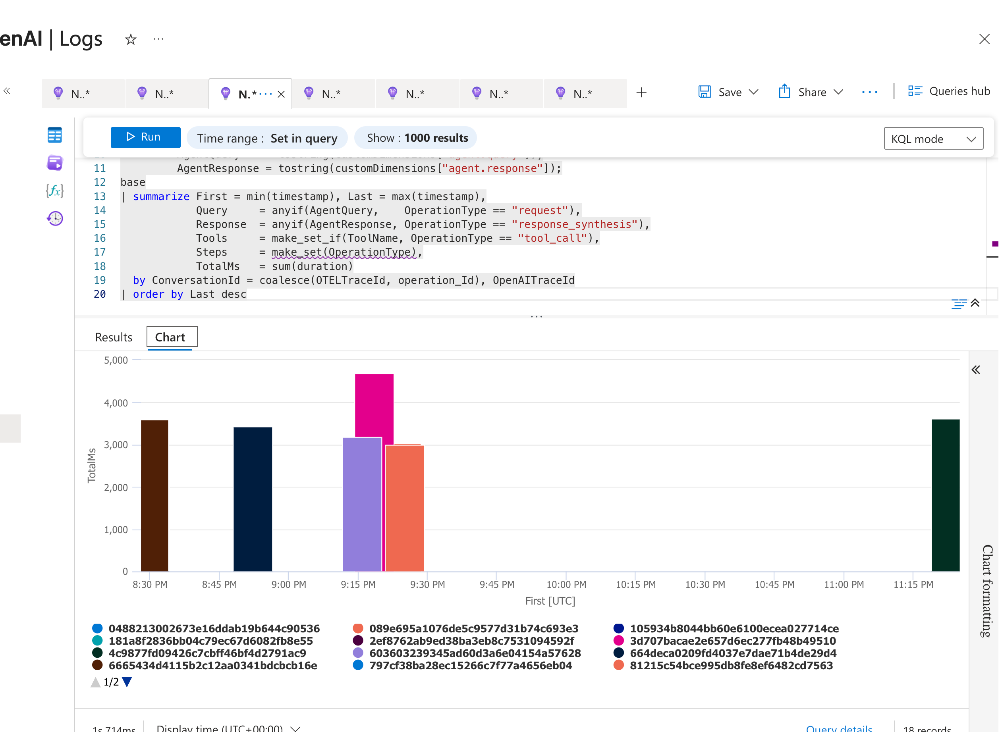
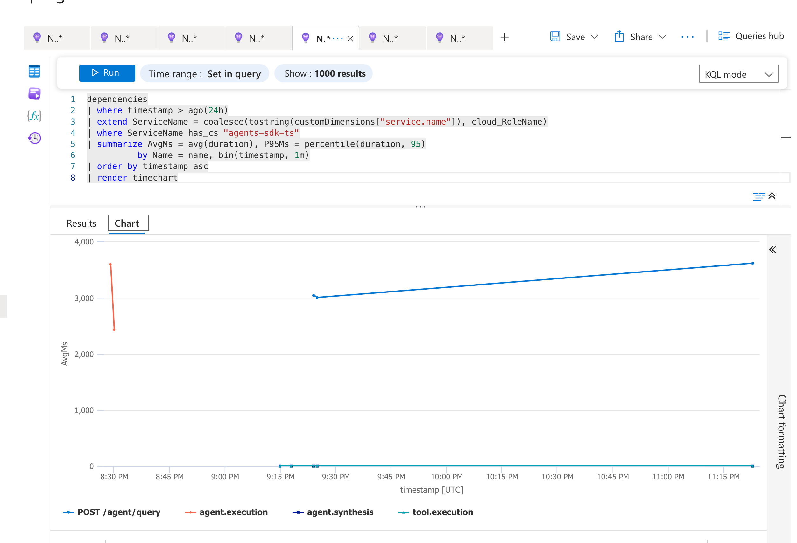
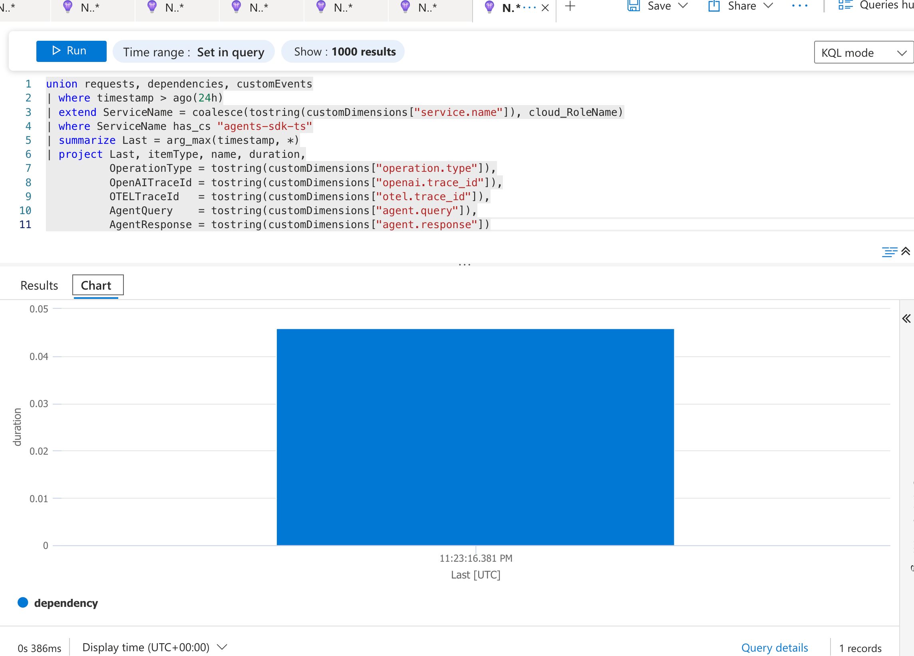

# 🎯 Complete Guide: OpenAI Agents SDK with Comprehensive Tracing & Observability

A step-by-step guide to implementing OpenAI Agents SDK with proper tracing, evaluation frameworks, and observability across multiple platforms.

## 📋 Table of Contents

- [Overview](#overview)
- [Prerequisites](#prerequisites) 
- [The Problem We Solved](#the-problem-we-solved)
- [Solution Architecture](#solution-architecture)
- [Step-by-Step Implementation](#step-by-step-implementation)
- [Key Gotchas & Solutions](#key-gotchas--solutions)
- [Testing & Validation](#testing--validation)
- [Observability Dashboards](#observability-dashboards)
- [Best Practices](#best-practices)
- [Troubleshooting](#troubleshooting)

## 🎯 Overview

This project demonstrates a **comparative evaluation framework** for agent implementations with comprehensive tracing and observability. It integrates:

- **TypeScript**: OpenAI Agents SDK with built-in tracing
- **C# .NET**: Semantic Kernel with Azure Monitor telemetry  
- **Python**: OpenAI evals framework for comparative testing
- **Multi-platform observability**: OpenAI Dashboard, Aspire Dashboard, Azure Application Insights

## 🔧 Prerequisites

- Ollama running locally (`ollama serve`) with models pulled
- .NET 8 SDK
- Node.js 20+
- Python 3.10+
- Docker Desktop (for Aspire Dashboard)
- OpenAI API Key
- Azure Application Insights (optional)

## 🚨 The Problem We Solved

### Initial Challenge
We started with standard OpenAI SDK calls but **no traces were appearing** in any dashboard:
- ❌ No traces in OpenAI Dashboard 
- ❌ No traces in Aspire Dashboard
- ❌ No traces in Azure Application Insights
- ❌ Generic "Agent workflow" names everywhere

### Root Cause Discovery
The issue was using the **wrong SDK**:
- ❌ `openai` package → No built-in tracing
- ✅ `@openai/agents` package → Built-in comprehensive tracing

> **Key Insight**: Until traces appear in OpenAI's own dashboard, downstream tracing systems won't work either.

## 🏗️ Solution Architecture


## 📚 Step-by-Step Implementation

### 1. Install OpenAI Agents SDK

```bash
cd agents-sdk-ts
npm install @openai/agents zod@3.25.67
```

> **⚠️ Critical**: Use `zod@3.25.67` or older - newer versions have compatibility issues

### 2. Create Proper Tool Definition

```typescript
import { Agent, run, tool } from "@openai/agents";
import { z } from "zod";

// ✅ Correct tool format using Agents SDK
const getLocalTimeTool = tool({
  name: "get_local_time",
  description: "Get the current local time in ISO-8601 format",
  parameters: z.object({
    // Empty object for no parameters
  }),
  async execute(input) {
    return new Date().toISOString();
  }
});
```

### 3. Create Agent with Custom Name

```typescript
// ✅ Use descriptive agent names for better tracing
const timeAgent = new Agent({
  name: "TimeAgent-SingleQuery", // Custom name instead of generic
  model: "gpt-4o-mini",
  instructions: "You are a helpful time assistant...",
  tools: [getLocalTimeTool]
});
```

### 4. Run with Automatic Tracing

```typescript
// ✅ Simple run - tracing happens automatically
const result = await run(timeAgent, "What time is it?");

// Extract response
const finalMessage = result.output.find(item => 
  item.type === 'message' && item.role === 'assistant'
);
const responseText = finalMessage?.content?.[0]?.text;

console.log("Response:", responseText);
console.log("Trace ID:", result.state._trace?.traceId);
```

### 5. Set Up Environment Variables

```bash
# agents-sdk-ts/.env
OPENAI_API_KEY=your-key-here
OTEL_EXPORTER_OTLP_ENDPOINT=http://localhost:18889/v1/traces
AZURE_MONITOR_CONNECTION_STRING=InstrumentationKey=...;IngestionEndpoint=...
```

### 6. Configure Multi-Platform Tracing (Optional)

```typescript
// otel.ts - for additional OTLP/Azure export
import { NodeTracerProvider } from "@opentelemetry/sdk-trace-node";
import { OTLPTraceExporter } from "@opentelemetry/exporter-trace-otlp-http";
import { AzureMonitorTraceExporter } from "@azure/monitor-opentelemetry-exporter";
import { BatchSpanProcessor } from "@opentelemetry/sdk-trace-base";

const provider = new NodeTracerProvider();

// OTLP for Aspire Dashboard
const otlpExporter = new OTLPTraceExporter();
provider.addSpanProcessor(new BatchSpanProcessor(otlpExporter));

// Azure Monitor
if (process.env.AZURE_MONITOR_CONNECTION_STRING) {
  const azureExporter = new AzureMonitorTraceExporter({
    connectionString: process.env.AZURE_MONITOR_CONNECTION_STRING,
  });
  provider.addSpanProcessor(new BatchSpanProcessor(azureExporter));
}

provider.register();
```

## ⚠️ Key Gotchas & Solutions

### Gotcha #1: Wrong SDK Usage
```typescript
// ❌ Standard OpenAI SDK - NO tracing
import OpenAI from "openai";
const client = new OpenAI();
const response = await client.chat.completions.create({...});

// ✅ OpenAI Agents SDK - Built-in tracing  
import { Agent, run } from "@openai/agents";
const result = await run(agent, query);
```

### Gotcha #2: Incorrect Tool Definition Format
```typescript
// ❌ Wrong format - causes "Unsupported tool type" error
tools: [{
  name: "get_time",
  description: "...",
  parameters: { type: "object", properties: {} },
  function: () => new Date().toISOString()
}]

// ✅ Correct Agents SDK format
const timeTool = tool({
  name: "get_time", 
  description: "...",
  parameters: z.object({}),
  async execute() { return new Date().toISOString(); }
});
```

### Gotcha #3: Generic Workflow Names
```typescript
// ❌ All workflows show as "Agent workflow"
const agent = new Agent({ name: "Assistant", ... });

// ✅ Descriptive names for better tracing
const agent = new Agent({ 
  name: "TimeAgent-ISOSpecific", 
  ... 
});
```

### Gotcha #4: Zod Version Compatibility
```bash
# ❌ This will break the Agents SDK
npm install zod@latest

# ✅ Use compatible version  
npm install zod@3.25.67
```

### Gotcha #5: withTrace() Issues
```typescript
// ❌ withTrace() can cause "trace.start is not a function"
const result = await withTrace({...}, () => run(agent, query));

// ✅ Use different agent names instead
const singleQueryAgent = new Agent({ name: "Agent-SingleQuery", ... });
const batchTestAgent = new Agent({ name: "Agent-BatchTest", ... });
```

### Gotcha #6: OpenTelemetry Conflicts
```bash
# ❌ These can conflict with Agents SDK tracing
npm install @opentelemetry/auto-instrumentations-node

# ✅ Let Agents SDK handle tracing, add OTLP separately if needed
npm uninstall @opentelemetry/auto-instrumentations-node
```

## 🧪 Testing & Validation

### Comprehensive Test Suite

```typescript
// agents-sdk-ts/enhanced-agent.ts
async function comprehensiveTest() {
  const testCases = [
    {
      agent: new Agent({ name: "TimeAgent-ISOSpecific", ... }),
      query: "I need the current time in ISO-8601 format",
      category: "ISO-specific"
    },
    {
      agent: new Agent({ name: "TimeAgent-GeneralTime", ... }),
      query: "What's the current time?", 
      category: "General time"
    },
    {
      agent: new Agent({ name: "TimeAgent-UrgentRequest", ... }),
      query: "I urgently need to know the time!",
      category: "Urgent"
    }
  ];
  
  for (const testCase of testCases) {
    const result = await run(testCase.agent, testCase.query);
    // Each creates distinct workflow traces
  }
}
```

### Python Evaluation Framework

```python
# evals/comprehensive_eval.py
class ComprehensiveEval:
    def test_python_vs_typescript_consistency(self):
        # Test Python OpenAI direct calls
        python_response = self.client.chat.completions.create(...)
        
        # Test TypeScript Agents SDK  
        ts_result = subprocess.run(["npx", "ts-node", "enhanced-agent.ts"])
        
        # Compare consistency
        return self.compare_responses(python_response, ts_result)
```

## 📊 Observability Dashboards

### 1. OpenAI Dashboard (Primary)
- **URL**: https://platform.openai.com/organization/logs  
- **What to look for**:
  - Workflow names: `TimeAgent-SingleQuery`, `TimeAgent-BatchTest`, etc.
  - Tool calls: `get_local_time()` executions
  - Trace IDs: `trace_909b5ba7c4894f31...`
  - Request/response pairs with timestamps


*OpenAI Dashboard showing successful tool calls and agent responses with timing*

#### Successful Tool Call Traces

*Detailed view of get_local_time() tool executions with ISO-8601 timestamps*

#### Agent Workflow Overview  

*Multiple TimeAgent workflows with execution times and handoff counts*

### 2. Aspire Dashboard (OTLP)
- **URL**: http://localhost:18888
- **Setup**: 
  ```bash
  docker run -d --name otel-dashboard \
    -p 18888:18888 -p 18889:18889 \
    mcr.microsoft.com/dotnet/aspire-dashboard:8.0
  ```
- **What to see**: HTTP traces from OpenAI API calls

### 3. Azure Application Insights
- **Setup**: Add connection string to `.env`
- **What to see**: Custom telemetry and trace correlation

#### KQL Query Results & Analysis

##### Items Ingested Verification


*Verification query showing all telemetry items ingested from the agents-sdk-ts service*

##### Conversation Rollup with OpenAI Trace Correlation



*Complete conversation flow analysis with OpenAI trace ID correlation, showing query/response pairs and tool usage*

##### Performance & Latency Analysis



*Latency metrics across different operation types (requests, tool calls, response synthesis)*

##### OpenAI Trace ID Propagation Verification


*Validation that OpenAI trace IDs are properly stamped on all operation types*

##### Latest Message Detailed Analysis



*Most recent agent execution showing complete telemetry context including query, response, and trace correlation*

> 📊 **KQL Queries**: All queries used to generate these results are available in [`kqls/kqlfromchatgpt.md`](kqls/kqlfromchatgpt.md) for easy copy-paste into Azure Application Insights.

## 🎯 Best Practices

### 1. Agent Naming Strategy
```typescript
// ✅ Descriptive, hierarchical naming
const agents = {
  singleQuery: new Agent({ name: "TimeAgent-SingleQuery", ... }),
  batchTest: new Agent({ name: "TimeAgent-BatchTest", ... }),
  isoSpecific: new Agent({ name: "TimeAgent-ISOSpecific", ... }),
  urgent: new Agent({ name: "TimeAgent-UrgentRequest", ... })
};
```

### 2. Tool Organization
```typescript
// ✅ Reusable tool definitions
const commonTools = {
  getCurrentTime: tool({
    name: "get_local_time",
    description: "Get current time in ISO-8601 format",
    parameters: z.object({}),
    async execute() { return new Date().toISOString(); }
  }),
  
  formatTime: tool({
    name: "format_time", 
    description: "Format time in different formats",
    parameters: z.object({
      format: z.string().describe("Format type: iso, unix, human")
    }),
    async execute({ format }) {
      const now = new Date();
      switch(format) {
        case 'iso': return now.toISOString();
        case 'unix': return now.getTime().toString();
        case 'human': return now.toLocaleString();
        default: return now.toISOString();
      }
    }
  })
};
```

### 3. Error Handling & Monitoring
```typescript
async function runWithMonitoring(agent: Agent, query: string) {
  try {
    const result = await run(agent, query);
    
    // Log successful execution
    console.log(`✅ ${agent.name}: ${result.state._trace?.traceId}`);
    
    return result;
  } catch (error) {
    // Log errors with context
    console.error(`❌ ${agent.name} failed:`, error.message);
    
    // Could send to monitoring system
    // await sendToMonitoring({ agent: agent.name, error, query });
    
    throw error;
  }
}
```

### 4. Evaluation Patterns
```python
# Python evaluation best practices
def evaluate_agent_consistency():
    """Compare multiple agent implementations"""
    
    test_cases = [
        {"query": "What time is it?", "expected_format": "iso"},
        {"query": "Give me timestamp", "expected_format": "iso"},
        {"query": "Current time please", "expected_format": "readable"}
    ]
    
    results = []
    
    for case in test_cases:
        # Test TypeScript Agents SDK
        ts_result = run_typescript_agent(case["query"])
        
        # Test Python direct OpenAI
        py_result = run_python_openai(case["query"])
        
        # Compare and score
        consistency_score = compare_responses(ts_result, py_result)
        
        results.append({
            "query": case["query"],
            "ts_response": ts_result,
            "py_response": py_result,
            "consistency": consistency_score
        })
    
    return results
```

## 🔧 Troubleshooting

### Problem: No traces in OpenAI Dashboard
**Symptoms**: Agents SDK runs but no traces appear
**Solutions**:
1. ✅ Verify `OPENAI_API_KEY` is set correctly
2. ✅ Check you're using `@openai/agents` not `openai`
3. ✅ Ensure agent names are descriptive, not generic
4. ✅ Wait 30-60 seconds for traces to appear


*Example of proper OpenAI Dashboard trace display with various agent types and tool calls*

### Problem: "Unsupported tool type" error  
**Symptoms**: `Error: Unsupported tool type: {"type":"hosted_tool"}`
**Solutions**:
1. ✅ Use `tool()` function from `@openai/agents`
2. ✅ Define parameters with Zod schema: `z.object({})`
3. ✅ Use `async execute()` method, not `function`

### Problem: "trace.start is not a function"
**Symptoms**: Error when using `withTrace()`
**Solutions**:
1. ✅ Remove custom OpenTelemetry auto-instrumentations
2. ✅ Use different agent names instead of `withTrace()`
3. ✅ Let Agents SDK handle tracing automatically

### Problem: Dependency conflicts with Zod
**Symptoms**: `ERESOLVE` errors during npm install
**Solutions**:
1. ✅ Use `zod@3.25.67` specifically
2. ✅ Use `npm install --force` if needed
3. ✅ Remove conflicting OpenTelemetry packages

### Problem: No traces in Aspire/Azure
**Symptoms**: OpenAI traces work, but not downstream
**Solutions**:
1. ✅ Verify Docker container is running on correct ports
2. ✅ Check `.env` configuration for endpoints
3. ✅ Ensure Azure connection string is valid
4. ✅ Test direct connectivity: `curl http://localhost:18889/v1/traces`

## 🎉 Expected Results

After following this guide, you should see:

### OpenAI Dashboard
- ✅ Distinct workflows: `TimeAgent-SingleQuery`, `TimeAgent-BatchTest`, etc.
- ✅ Tool call traces showing `get_local_time()` executions
- ✅ Complete request/response chains with timing
- ✅ Searchable by agent name and trace ID

### Console Output
```
🤖 Enhanced Agents SDK Test with Custom Agent Names
================================================
📝 Query: What's the time right now? Please respond with an ISO-8601 timestamp.
✅ Agent Response: The current time is **2025-08-09T16:41:45.768Z** in ISO-8601 format.
🆔 Trace ID: trace_909b5ba7c4894f319f1b2eecfbd9977f
🔧 Tool used: get_local_time → 2025-08-09T16:41:45.768Z

📊 This should appear in OpenAI Dashboard as:
   🏷️  Agent: TimeAgent-SingleQuery
   📈 Look for workflow with this agent name
```

### Evaluation Results
```
🚀 Starting Comprehensive Agent Evaluation
==================================================
✅ Infrastructure connectivity verified
✅ Tracing system working  
✅ Agent implementations consistent

🎯 Overall Results: 3/3 tests passed
🎉 ALL SYSTEMS OPERATIONAL!
```

---

## 📝 Summary

This comprehensive guide solved the complex challenge of implementing proper tracing and observability for OpenAI Agents SDK. The key breakthrough was recognizing that **proper tracing starts with the right SDK** - the OpenAI Agents SDK has built-in tracing that automatically integrates with OpenAI's dashboard, making downstream observability possible.

The solution provides a robust foundation for multi-agent systems with full observability, comparative evaluation, and production-ready monitoring across multiple platforms.

**Key Takeaway**: When observability isn't working, start from the source (OpenAI Dashboard) and work outward to downstream systems. Fix the root integration first, then everything else follows.

---

*Happy tracing! 🚀*