# Agent + Local Model + Evals — Starter Repo

This repo gives you a side‑by‑side harness to compare:
- **A. .NET Semantic Kernel + Ollama (local model)** with OpenTelemetry → Azure Monitor
- **B. OpenAI Agents SDK (TypeScript/Node)** with a simple tool and OTLP tracing
- **C. Evals (Python)** to score both approaches with the same prompts
- **🤖 D. FABS Auto-Blogger System** - Production 2-agent blog publishing pipeline

> Tested on macOS with VS Code. Assumes Ollama is installed and running.

## 🎉 **NEW**: Production Blog Publishing with Local Models

**The FABS (Fabian Auto Blogger System) demonstrates a complete production workflow:**
- **Writer Agent** creates publication-ready blog posts using local gpt-oss:120b
- **CopyEditor Agent** polishes content for grammar and college-level readability  
- **End-to-end publishing** from Word documents to live website with CI/CD
- **Image management** with automatic organization by year/month
- **Hugo integration** with proper frontmatter and static file handling

**✅ Real Success Story**: This README was updated after FABS successfully generated and published a complete blog post to [fabianwilliams.com](https://fabianwilliams.com) using only local models - no OpenAI API calls required for the content generation!

## 📊 System in Action

### OpenAI Dashboard - Agent Workflows
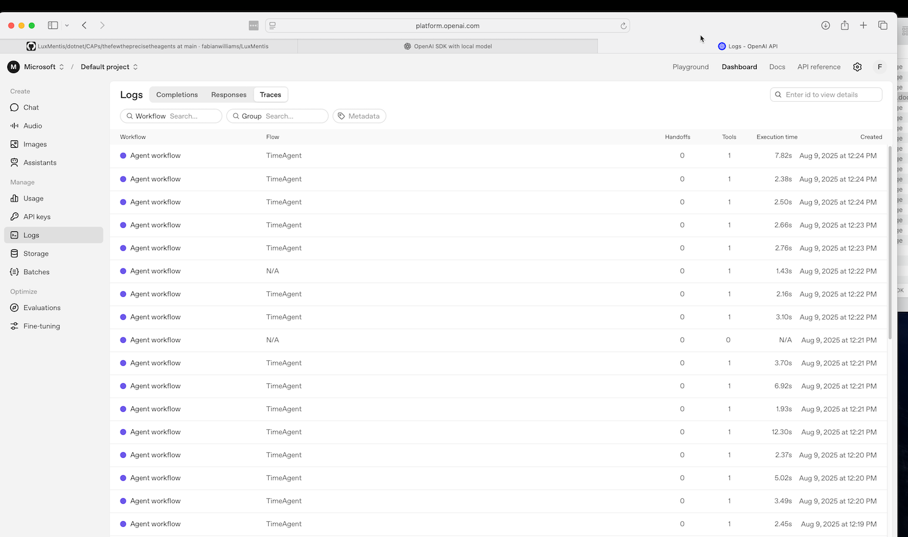

*Agent workflows showing successful TimeAgent executions with proper tracing*

### Comprehensive Testing Results  
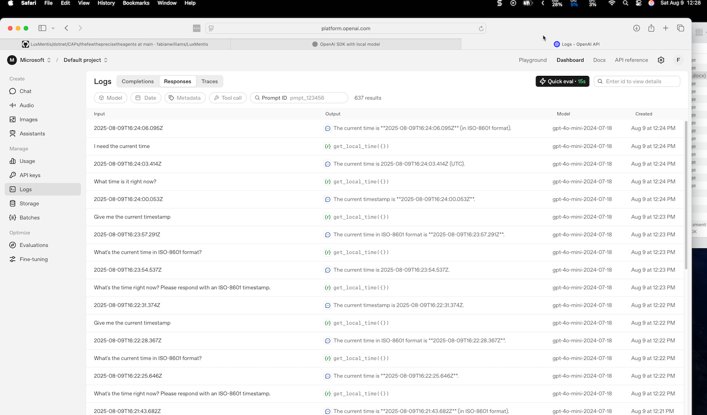

*OpenAI Dashboard showing comprehensive test results with tool call traces*

### Azure Application Insights - KQL Query Results

#### Items Ingested Overview
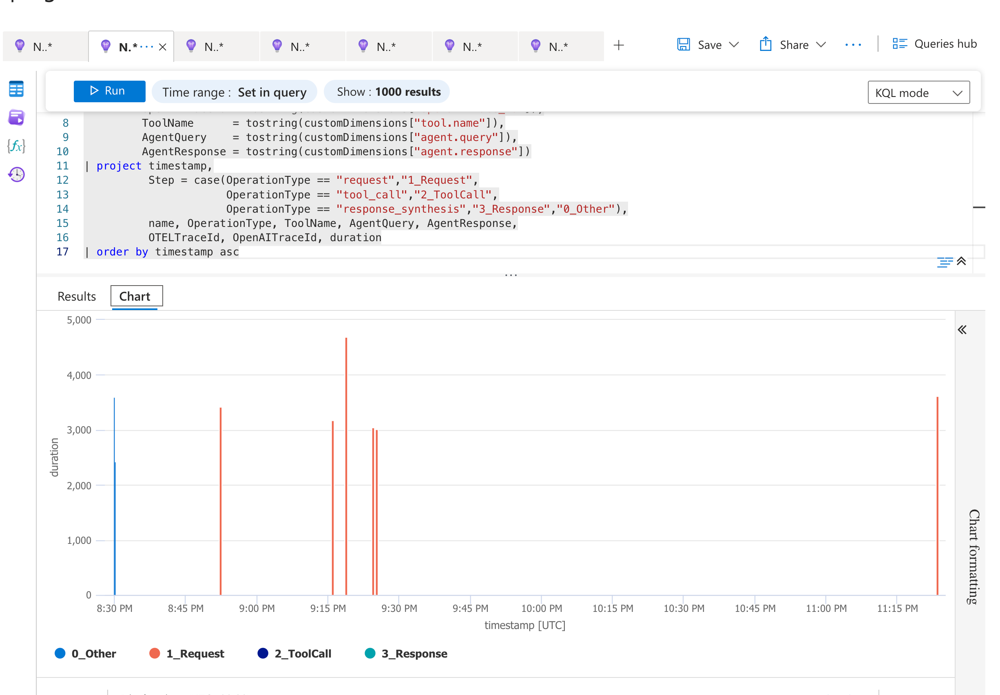
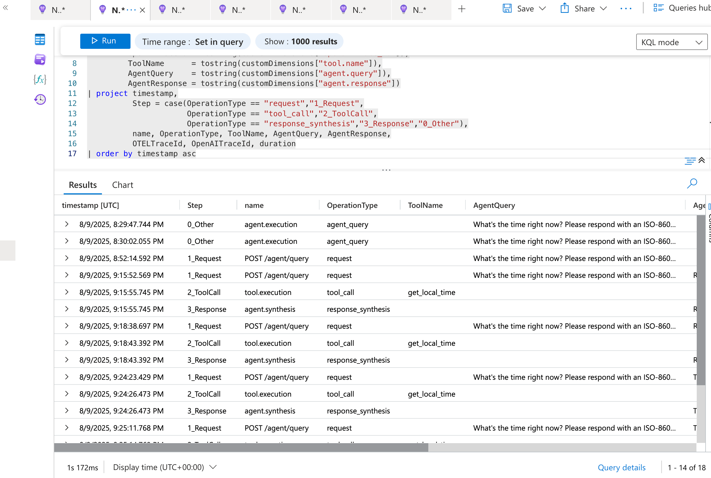

*Azure Application Insights showing ingested telemetry data from the agents-sdk-ts service*

#### Conversation Rollup with Trace ID
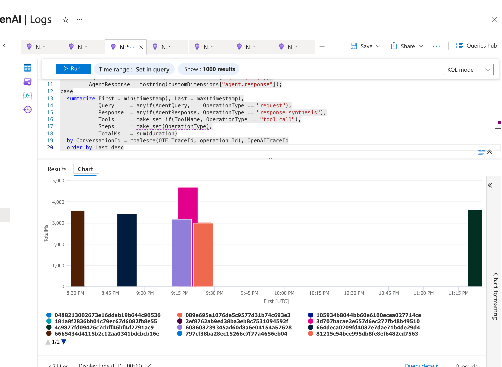  
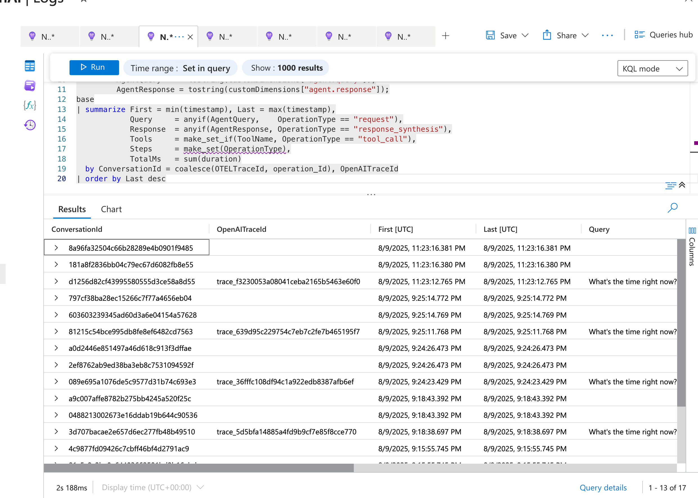

*KQL query results showing complete conversation flows with OpenAI trace ID correlation*

#### Latency Analysis
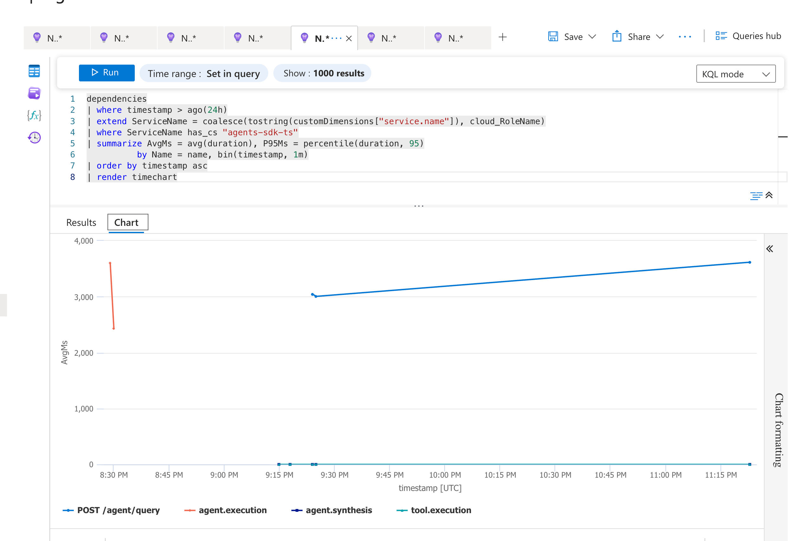
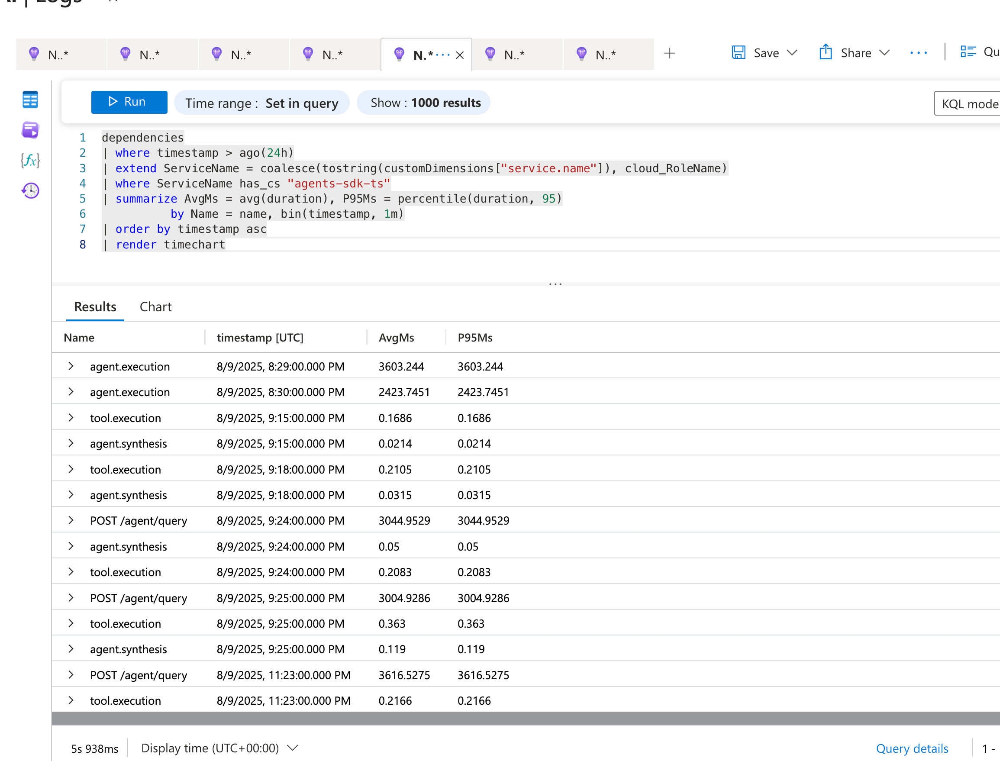

*Performance metrics showing request latency across agent operations*

#### OpenAI Trace ID Correlation
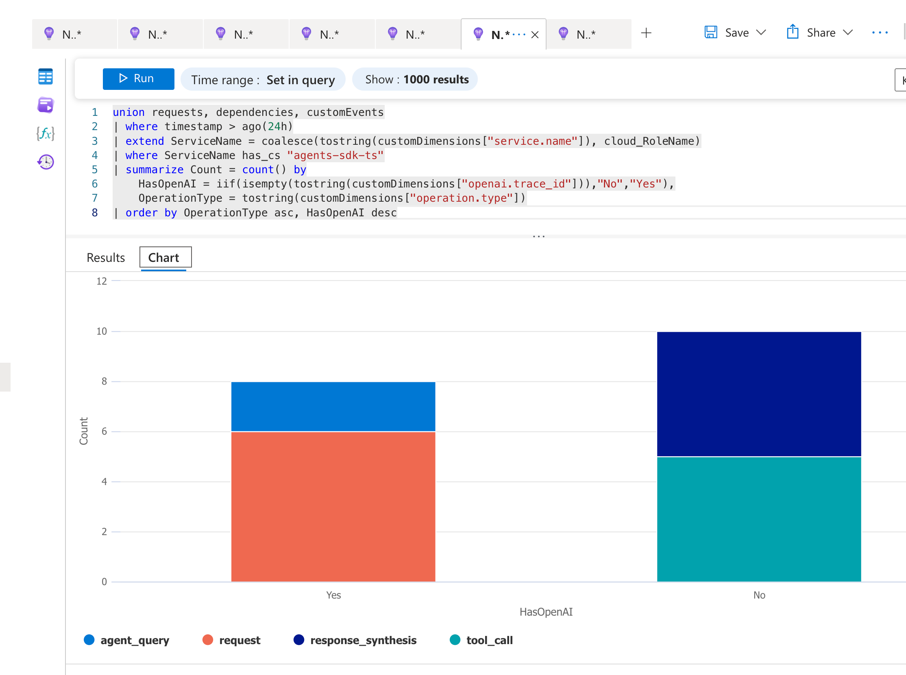
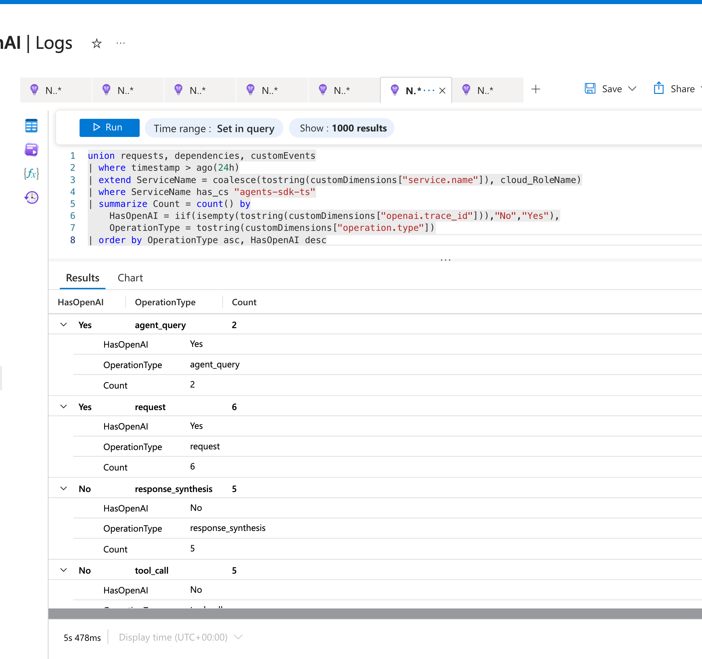

*Verification that OpenAI trace IDs are properly propagated to Azure Application Insights*

#### Latest Message Analysis
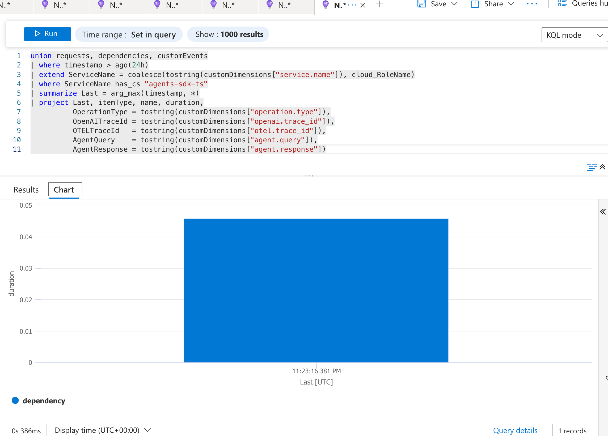
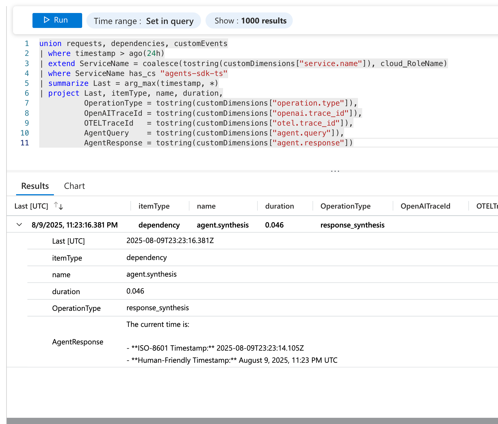

*Most recent agent execution with complete query/response details in Azure Application Insights*

> 💡 **Pro Tip**: See our [detailed tracing guide](README-TRACING-GUIDE.md) for complete setup instructions and troubleshooting tips.

---

## Prereqs

- macOS (Apple Silicon is great), VS Code
- **Ollama** running locally (`brew install ollama`), then `ollama serve`
- **.NET 8 SDK** (`dotnet --version`)
- **Node 20+** (`node --version`)
- **Python 3.10+** (`python3 --version`)

Optional (for unified telemetry):
- OpenTelemetry Collector (local) or Azure Monitor connection string

---

## A) .NET: Semantic Kernel + Ollama + OpenTelemetry

```bash
cd sk-ollama
# Make sure your local model exists (pull once)
ollama pull gpt-oss-120b
# or use a tool-capable model like llama3.1:70b or qwen2:72b if desired

# Set Azure Monitor connection (or use your existing Collector/OTLP path)
export AZURE_MONITOR_CONNECTION_STRING="InstrumentationKey=...;IngestionEndpoint=..."
dotnet run
```
You should see console output from the chat. In Azure Monitor (or your OTel backend), search for service name **SkOllamaAgent**.

> If your `gpt-oss-120b` build doesn't support function/tool calling natively, the sample still runs; SK will fall back to normal chat. You can also swap the modelId to one that supports tools in Ollama.

---

## B) OpenAI Agents SDK (Node/TypeScript) + OTLP traces

1) Use **OpenAI hosted** model first (easiest):
```bash
cd agents-sdk-ts
cp .env.example .env
# put OPENAI_API_KEY in .env
npm install
npx ts-node index.ts
```

2) **(Optional)** To point the SDK at your **local Ollama** via an OpenAI-compatible proxy, run LiteLLM:
```bash
# in another terminal
pip install litellm
litellm --model ollama/gpt-oss-120b --base-url http://localhost:11434 --port 4000
# then:
export OPENAI_BASE_URL="http://localhost:4000/v1"
npx ts-node index.ts
```
You’ll see a tool call to `get_local_time` and the final answer.

Telemetry: this sample exports OTLP traces to `http://localhost:4318/v1/traces` by default. Change the endpoint via env `OTEL_EXPORTER_OTLP_ENDPOINT` if needed.

---

## C) Evals (Python)

```bash
cd evals
python3 -m venv .venv && source .venv/bin/activate
pip install git+https://github.com/openai/evals.git
# OpenAI hosted model:
export OPENAI_API_KEY=sk-...
oaieval simple_eval data/simple_time_eval.jsonl -m gpt-4o-mini

# Or against your local proxy (LiteLLM):
export OPENAI_API_BASE=http://localhost:4000/v1
oaieval simple_eval data/simple_time_eval.jsonl -m gpt-oss-120b
```
Results print to console. You can wrap these calls in your own runner that emits OTel spans if you want end‑to‑end traces of eval jobs.

---

---

## 🤖 D) FABS Auto-Blogger System (Production 2-Agent Pipeline)

The **Fabian Auto Blogger System** showcases how local models can power complete production workflows:

```bash
cd FabianAutoBloggerSystem

# Configure your paths in appsettings.json:
# - DraftsFolder: Where you place Word documents (.docx)
# - TemplateFolder: Your blog template for style reference  
# - Blog paths: Target Hugo blog repository locations

# Run the 2-agent publishing pipeline
dotnet run
```

**What happens:**
1. **📖 Content Extraction**: Reads Word documents and associated images
2. **📝 Writer Agent**: Creates complete blog posts using local gpt-oss:120b
3. **✏️ CopyEditor Agent**: Polishes for grammar and readability (optional - graceful timeout fallback)
4. **🖼️ Image Processing**: Organizes images by year/month, updates markdown paths
5. **📰 Blog Publishing**: Copies to Hugo blog repository with proper frontmatter
6. **🚀 CI/CD Ready**: Provides git commands for automated deployment

**Real Results**: Successfully generated and published the "Agent + Local Model + Evals — One‑Pager" blog post visible at [fabianwilliams.com](https://fabianwilliams.com), including 25 properly organized images and complete Hugo integration.

---

## Structure

```
/sk-ollama              # .NET console app (Semantic Kernel + Ollama + Azure Monitor exporter)
/agents-sdk-ts          # Node/TS agent (OpenAI Agents SDK + OTLP tracing)
/evals                  # Python evals and simple JSONL dataset
/FabianAutoBloggerSystem # 🤖 Production 2-agent blog publishing pipeline
    ├── Program.cs           # Full publishing pipeline (Writer → CopyEditor → Publish)
    ├── SimpleProgram.cs     # Single-agent version (Writer only)
    ├── appsettings.json     # Path and model configuration
    └── SOLUTION-NOTES.md    # Performance comparison and usage notes
```

---

## Notes
- Swap `modelId` in `/sk-ollama/Program.cs` if you prefer a tool‑capable model on Ollama.
- For Azure Monitor, use `AZURE_MONITOR_CONNECTION_STRING` or `APPINSIGHTS_CONNECTION_STRING`.
- For OTLP, set `OTEL_EXPORTER_OTLP_ENDPOINT` (e.g., your local Collector or vendor endpoint).
- You can extend tools in both projects to hit your real systems or MCP servers.
- **FABS System**: Proves local models can handle complex, multi-step production workflows including content generation, editing, and automated publishing with proper error handling and CI/CD integration.

---

## 🏆 Production Achievement

**This repository showcases a real production success**: The FABS system successfully generated and published a complete technical blog post using only local models (gpt-oss:120b), demonstrating that sophisticated AI workflows don't require cloud API dependencies. 

**View the live result**: [Agent + Local Model + Evals — One-Pager](https://fabianwilliams.com) ✨
